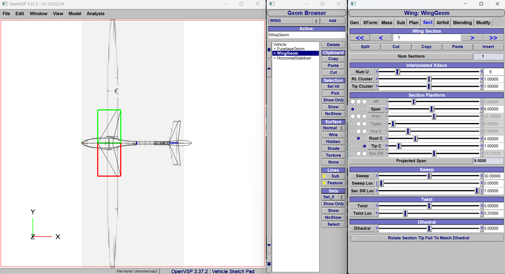
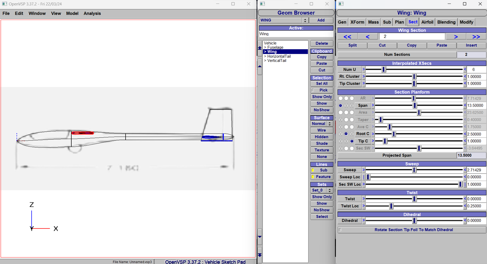
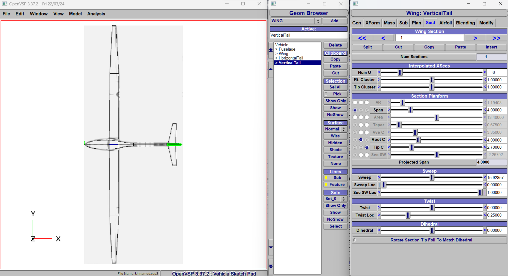
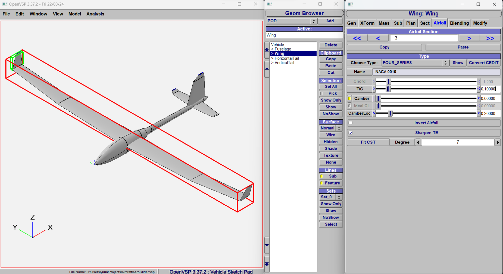

<!-- PROJECT LOGO -->
 

  

<h3 align="center">Flight Dynamics Project</h3>

  

    Design Considerations for Stability and Efficiency in Glider Unmanned Aerial Vehicle
     
    <a href="https://github.com/yuriachermann/Flight-Dynamics-Project"><strong>Explore the docs »</strong></a>
     
     
    <a href="https://website.com">View Demo</a>
    ·
    <a href="https://github.com/yuriachermann/Flight-Dynamics-Project/issues">Report Bug</a>
    ·
    <a href="https://github.com/yuriachermann/Flight-Dynamics-Project/issues">Request Feature</a>
  

<!-- TABLE OF CONTENTS -->

  
Table of Contents

  <ol>
    <li>
      <a href="#about-the-project">About The Project</a>
      <ul>
        <li><a href="#built-with">Built With</a></li>
      </ul>
    </li>
    <li>
      <a href="#getting-started">Getting Started</a>
      <ul>
        <li><a href="#prerequisites">Prerequisites</a></li>
        <li><a href="#installation">Installation</a></li>
      </ul>
    </li>
    <li><a href="#usage">Usage</a></li>
    <li><a href="#roadmap">Roadmap</a></li>
    <li><a href="#contact">Contact</a></li>
    <li><a href="#acknowledgments">Acknowledgments</a></li>
  </ol>

<!-- ABOUT THE PROJECT -->
## About The Project

Design Considerations for Stability and Efficiency in Unmanned Aerial Vehicle

(<a href="#readme-top">back to top</a>)

### Built With

* [![Python][Python]][Python-url]

(<a href="#readme-top">back to top</a>)

<!-- GETTING STARTED -->
## Getting Started

To get a local copy up and running follow these simple example steps.

### Prerequisites

* Python >= 3.12
* [OpenVSP](https://openvsp.org/download.php)

### Installation

(<a href="#readme-top">back to top</a>)

<!-- USAGE EXAMPLES -->
## Usage

# OpenVSP

(<a href="#readme-top">back to top</a>)

<!-- ROADMAP -->
## Roadmap

(<a href="#readme-top">back to top</a>)

<!-- CONTACT -->
## Contact

Yuri Winche Achermann - [@YuriAchermann](https://twitter.com/YuriAchermann) - yuri.achermann@gmail.com

(<a href="#readme-top">back to top</a>)

<!-- ACKNOWLEDGMENTS -->
## Acknowledgments

(<a href="#readme-top">back to top</a>)

<!-- MARKDOWN LINKS & IMAGES -->
<!-- https://www.markdownguide.org/basic-syntax/#reference-style-links -->
[product-screenshot]: images/screenshot.png
[Python]: https://img.shields.io/badge/Python-000000?style=for-the-badge&logo=python
[Python-url]: https://www.python.org